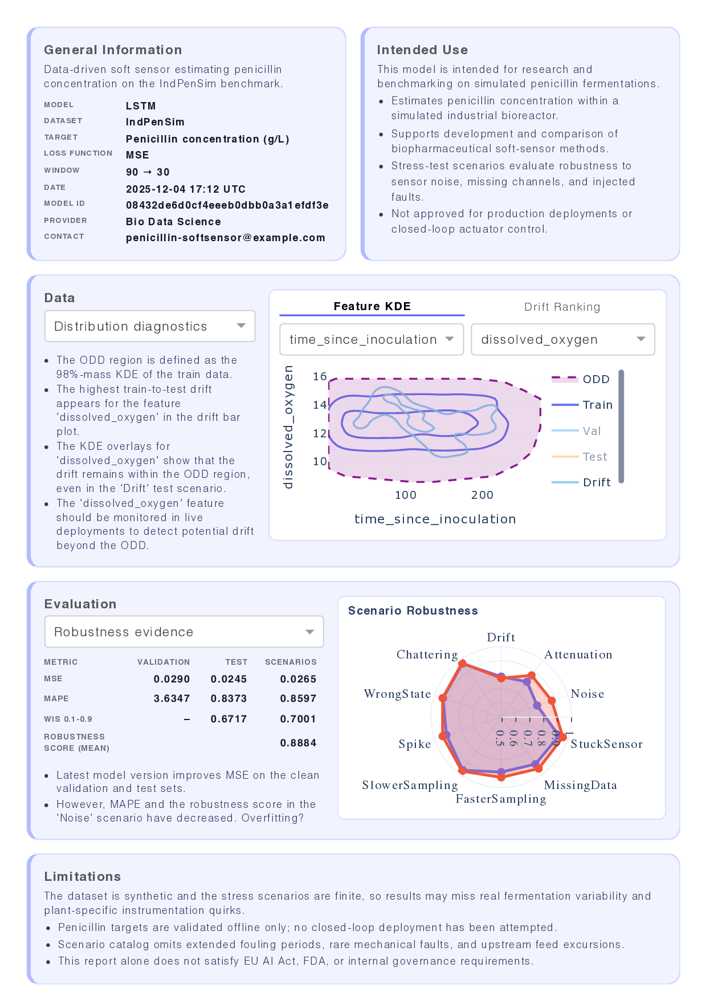
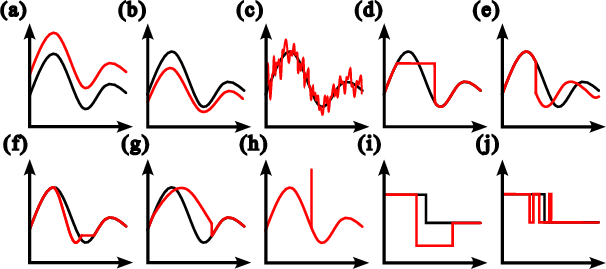

# Model Card Reporting (IndPenSim)

This branch only ships the reporting layer used in the paper. Training and testing pipelines can be found in this repository: [https://github.com/awindmann/cps-robustness-benchmark](https://github.com/awindmann/cps-robustness-benchmark).

## Layout
- `run_reporting.py` – CLI to serve the Dash model card
- `reporting/` – report bundle builder, Dash app, model card copy, log validator
- `data/profiling.py` – load dataset profiles logged by the testing pipeline
- `data/datasets/specs.py` – IndPenSim registry entry
- `assets/` – dashboard CSS
- `logs/564684664407632204/` – example MLflow experiment
- `notebooks/data-indpensim.ipynb` – dataset provenance notebook

## Install (uv or pip)
- Using uv (recommended): `uv venv && source .venv/bin/activate && uv pip sync requirements.txt`
- Using pip: `python -m venv .venv && source .venv/bin/activate && pip install -r requirements.txt`

## Quickstart
Run commands from the repository root so the relative MLflow artifact URIs resolve correctly.
1. Ensure dependencies are installed (see above).
2. Run the validator to ensure logs are complete: `python -m reporting.validate_logs --logdir logs --experiment-prefix card-02 --dataset IndPenSim`
3. Launch the dashboard: `python run_reporting.py --logdir logs --mlflow-experiment-prefix card-02 --data-files IndPenSim --report-serve`
4. Open the Dash app at `http://localhost:8050`

## Stress test scenarios
The robustness evaluation uses severity-controlled sensor fault scenarios from [Windmann et al., 2025](https://ieeexplore.ieee.org/abstract/document/11205527):

## Logging contract
Reporting expects MLflow experiments named `{prefix}-{dataset}` with:
- Tags/params: `dataset`, `stage` (`train` for backbone, `uq` for quantile), `model_architecture`, `tested=true` on evaluated runs, `phi_tag`, `test_metric`, `linked_backbone_run` + `quantile_level` for quantile runs
- Metrics: `<test_metric>_val`, `<test_metric>_test`, robustness metrics under `{phi_tag}/{test_metric}/…` (`R_mean`, `scenario/*/R_mean`), optional `quantile/WIS_{lower}_{upper}_clean|_pert` on backbone runs
- Artifacts: `dataset_stats/dataset_profile.json`, `robustness/{phi_tag}/{test_metric}/forecast_samples.json` for backbone and quantile runs

See `LOGGING_CONTRACT.md` for the exact schema.

## Acknowledgments
Portions of this codebase were edited with assistance from Claude (Anthropic) and Codex (OpenAI).
